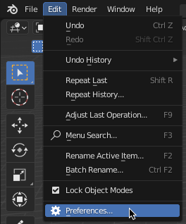
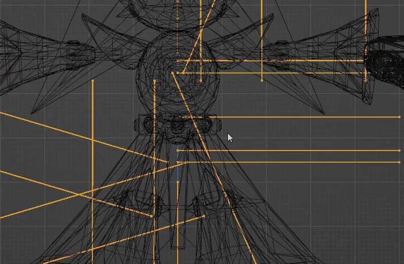
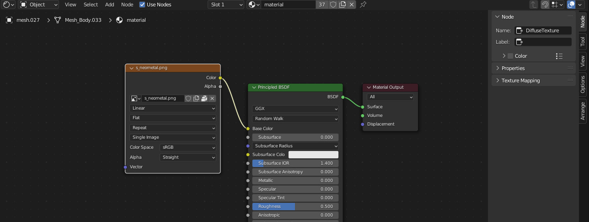
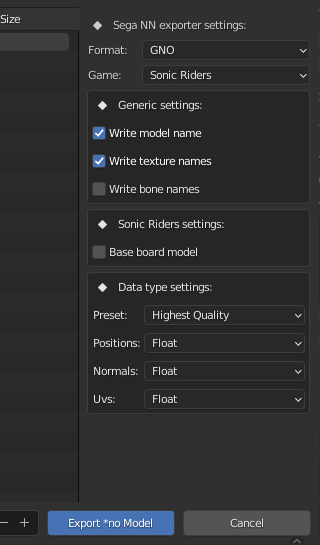
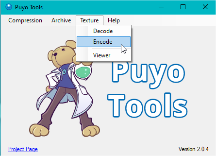
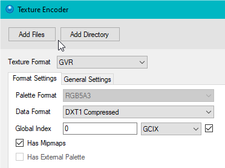
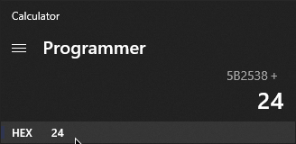

# Custom Model Guide

!!! info

    This guide is relatively recent and could probably be improved.  
    If you have used it and are familiar with the model editing workflow, please consider helping us.  

    This guide is generic and can be used with any supported version of Riders.  

!!! info

    [This guide is available in video form](https://www.youtube.com/watch?v=duIGbfS_Zho). 

!!! note

    The tooling at the moment in time only targets Windows. If you have a demand for alternate OS support, please let us know. [Model exporter](https://github.com/Argx2121/Sega_NN_tools) requires triangle stripping dependency with no native Python implementation. [Public contributions would be welcome!!]

!!! todo

    Packing textures. We kinda forgot to add this, but we gotta nap.  
    We'll add it tomorrow 'I Sewer'

## Prerequisites 

You will need to download the following items first.  

| Program                                                                                                                                                                                   | Purpose                                                                    |
|-------------------------------------------------------------------------------------------------------------------------------------------------------------------------------------------|----------------------------------------------------------------------------|
| [.NET 5 Runtime](https://dotnet.microsoft.com/download/dotnet/5.0) [(Windows)](https://dotnet.microsoft.com/en-us/download/dotnet/thank-you/runtime-desktop-5.0.17-windows-x64-installer) | Required to run Sewer's Sonic Riders tools.                                |
| [Blender](https://www.blender.org/download/)                                                                                                                                              | Modelling software.                                                        |
| [Sega NN Tools](https://github.com/Argx2121/Sega_NN_tools/archive/refs/heads/master.zip)                                                                                                  | Blender Plugin for Riders' Model Formats (and 20+ other games!).           |
| [RidersArchiveTool & RidersTextureArchiveTool](https://github.com/Sewer56/SonicRiders.Index/releases/latest)                                                                              | Sewer's tool for extracting compressed Riders archives & texture archives. |
| [Puyo Tools](https://github.com/nickworonekin/puyotools/releases/latest)                                                                                                                  | Used for texture conversion to Ninja (NN) Texture formats. |

It's recommended to download Blender from Steam; in order to receive automatic updates.

## Finding Game Files

### PC Riders


In the PC Version of Sonic Riders, there exists a folder called `Data`. This folder will have all of the files necessary to perform model edits.  

### GameCube Riders

!!! info 

    For the GameCube port of the game, you will first need to extract the ROM. The guidance below shows how to do that with Dolphin Emulator.

To do so, right click the game on your game list, and select `Properties`.  


Then scroll right to the `FileSystem` section, right click `Disc` and select `Extract Entire Disc`.


Go to the folder where you have extracted the ROM, and into the `files` folder.  
You will be getting the original models from this folder.  

(If this folder has >1000 files and/or contains a `_Main.rel` file then you probably found the right one.)

## Finding Models

!!! info 

    This section describes where to find your desired game models to edit.

This wiki contains a very useful page known as the [File Listing](../files/list.md). This page contains a list of all files in Vanilla PC Riders including what they are, and what they contain.  

In the case of player models, they use the format P{X}{YY}, where:  
- `P` represents 'Player'.  
- `{X}` is a single letter that is a shorthand for character.  `e.g. 'S' is Sonic, 'T' is Tails`  
- `{YY}` number that represents the gear. e.g. `00` is Default Gear.  


!!! tip 

    It is recommended you pick a model with similar proportions to the model you're replacing.  
    For example, if you're adding a human-like character; consider replacing Ulala.  

## Extracting Models

!!! info 

    This section describes how to extract the Riders Arc hives e.g. `PA00` to obtain the models.

### Extracting Archives

!!! info "If you already know Commandline."

    `RidersArchiveTool.exe extract --source <pathToArchive> --savepath <whereToOutput>`.  
    Include `--bigendian` if working for GCN.  

For this you will use `RidersArchiveTool.exe` that you have downloaded previously from the prerequisites.  
This is a commandline tool, so you will need to use the `Command Prompt`.  

- Open a `Command Prompt` window (Press `Super (Windows)` key, search `cmd` and press `Enter`).  
- Drag `RidersArchiveTool.exe` over the `cmd` window.  
- Press `space` and type in `extract` to make `<some_folder_path>/RidersArchiveTool.exe extract`, and press `enter`.  


This will show you the available options for extraction. In this case, we will want to specify `--source` and `--savepath`; to create a command such as `RidersArchiveTool.exe extract --source "D:\Games\ISOs\Sonic Riders Vanilla\files\PA00" --savepath "C:\Users\sewer\Downloads\Build\output" --bigendian`.  


### Finding the Model

!!! info 

    Demonstrates where the model is inside the extracted archive.

Inside the extracted folder you will find folders under the name `XXX_YYYYY`. `XXX` represents the original order of the file in the archive and `YYYYY` represents the type of the contents of that group of files. The known `YYYYY`s are documented over at [File Formats](../files/formats.md#internal-file-formats-all-ids).  

In any case, for Player models, this is `00000`. 


Model formats use the `.*NO` extension. For GameCube, this is `.GNO`; for PC this is `.XNO`.  
You can now import this model into Blender.  

!!! info 

    The Vanilla game combines the player model and gear e.g. `PA00` would contain Amy and her Default Gear.  
    Modern mods of Sonic Riders separate these models; so there's usually only 1 model for each character and 1 model (in a separate file) for each gear. Guidance for that will be available in the future.  

## Working with Blender

### Installing the Plugin

!!! info 

    Demonstrates how to install and run the plugin in Blender.

!!! warning

    You must download the latest version of the plugin from source code by clicking `Code` and then `Download Zip` on the page for [NN Tools](https://github.com/Argx2121/Sega_NN_tools). The current `GitHub Release` does not yet contain the exporter.  

    (If you used the guide in the link, nothing to worry about.)

To install the importer & exporter plugin, go to `Edit`->`Preferences`, and navigate to the `Add-ons` menu.  
Click `Install` and select the zip file for the plugin (This will probably be called `Sega_NN_tools-master.zip`).  




Click `Install` and select the zip file for the plugin (This will probably be called `Sega_NN_tools-master.zip`).  

Once you have installed the plugin, search for `NN`, and enable the `Sega NN Tools` plugin using the checkbox.


### Importing Models

!!! info 

    Demonstrates how to import an existing model into Blender.  

Open the `NN Tools` sidebar menu by pressing `N` on your keyboard while in 3d view, and selecting the `NN Tools` tab screenshot, left.  


Press `Model *.no` under `Import` and select the format (`.GNO for GameCube` or `.XNO for PC`), and `Sonic Riders` from the games list, navigate to your extracted model from earlier and press `Import`.  


### Renaming Bones

!!! info 

    Renaming bones using a blender script.

Imported Riders models will have autogenerated bone names, which are inconvenient to work with when rigging models.  


To fix this (at least for non-bike locked characters like Eggman), a blender script is provided below.  

```py
import bpy
from bpy.types import Armature, Object

bone_names = \
    ['Root', 'Board', 'Board_Mesh', 'Player', 'Body', 'Hips', 'Spine_1', 'Spine_2', 'Spine_3', 'Head_Root', 'Bone',
    'Head_Spike_1', 'Head_Spike_2', 'Head_Spike_3', 'Head_Spike_1_L', 'Head_Spike_2_L', 'Head_Spike_3_L',
    'Head_Spike_1_R', 'Head_Spike_2_R', 'Head_Spike_3_R', 'Ears_Root', 'Ear_1_L', 'Ear_2_L', 'Ear_3_L', 'Ear_1_R',
    'Ear_2_R', 'Ear_3_R', 'Head_Front_Hair', 'Head', 'Glasses', 'Shoulder_L', 'UpperArm_L', 'ForeArm_L', 'Hand_L',
    'Hand_Rest_L', 'Hand_Flat_L', 'Hand_Splay_L', 'Hand_Fist_L', 'Hand_Peace_L', 'Hand_Point_L', 'Shoulder_R',
    'UpperArm_R', 'ForeArm_R', 'Hand_R', 'Hand_Rest_R', 'Hand_Flat_R', 'Hand_Splay_R', 'Hand_Fist_R', 'Hand_Peace_R',
    'Hand_Point_R', 'Tail_Root', 'Tail_1', 'Tail_2', 'Tail_3', 'Tail_1_R', 'Tail_2_R', 'Tail_3_R', 'Tail_1_L',
    'Tail_2_L', 'Tail_3_L', 'Thigh_L', 'Calf_L', 'Foot_L', 'Toe_L', 'Toe_End_L', 'Thigh_R', 'Calf_R', 'Foot_R',
    'Toe_R', 'Toe_End_R', 'Body_Render']


def rename_bones():
    obj: Object = bpy.context.selected_objects[0]
    arma: Armature = obj.data
    for bone, b in zip(arma.bones, bone_names):
        bone.name = b


if __name__ == "__main__":
    rename_bones()
```

Select the armature/rig inside the Blender Scene Explorer and navigate to the `Scripting` tab. Paste the script and press the `Run` button.  

### Rigging the Model

!!! info 

    Applying the armature of the old model to your new model; to make it compatible with existing animations.  

Delete the meshes of the old model, and the armature of the new model you are replacing it with.


(Pictured: Deleting old meshes.)

Align the model armature over the new model. An easy way to do this is to center the position of both models to 0,0,0 in the `Transform` window.  


(Select old model in scene explorer, set transform to 0,0,0; repeat for new model)

#### Getting A Nicer View

!!! tip 

    Work with Wireframe mode (`Hotkey: Z`) to be able to see the bones and the model at the same time.  

It's highly recommended that you change the bones to display as a `stick` in the Viewport Display. Working with the defaults can be pretty messy.  




(this is cleaner than the alternative...)

#### Adjusting Bone Positions

!!! tip 

    Before adjusting the bones manually, consider scaling the bones to get a better fit with the new model.  

Once the old bones and new model are overlaid, it is recommended to manually move the bones to better match the model.  
e.g. you will want to nudge bones such that for example, a knee bone would match the middle of the knee rather than being off center.  


[Bad Positioning, Does not Match Knee Center]


[Better Positioning]

!!! warning 

    Be careful when moving bones. You should not move the bones' head or tail individually. Only move the bone as a whole. Moving head/tail individually will result in messed up animations due to a change in rotation.

#### Assigning Weights

!!! info 

    This part involves assinging 'weights' of vertices to individual bones in the armature.  
    'Weights' influence how movements of the bone affect movements of the individual vertices and is how animations work.  

First hide the armature, by selecting it and pressing the little `eye` icon (alternatively `Hotkey: H`).


Select everything with `A` on keyboard, unhide the armature (ctrl+click it in scene viewer, and `Alt+H`) and click one of the bones while holding `Shift`.  
Then press `Ctrl+P` to parent. Select `Armature Deform: With Empty Groups`.  

We have now made the meshes children to the rig, so you can go ahead and weight paint the model.

!!! tip 

    Automatic weights are not recommended, will likely weight to wrong bones due to sheer bone count.

!!! tip 

    You are now ready to weight.  
    Consider learning how to do this through external tutorials on YouTube and co.  
    Key phrase to search is 'weight painting blender guide'.  

#### Preparing Materials

!!! info 

    The Material set up listed here is expcted to change in the future to allow more customisability, and to show in blender what the model will look like in game more accurately.

Open blenders Shading Tab on the Top Bar to view blenders material set up.


Then select a mesh of your model. In the area below your model, you will see the materials set up for that mesh.
For Riders, there are a few material types supported:

- Diffuse texture (texture that puts colour on the mesh): `DiffuseTexture`

- Reflection texture (texture that makes the mesh look reflective): `ReflectionTexture`

- Emission texture (texture that allows the mesh to emit light): `EmissionTexture`

For the textures in the material area, you want to set the images node name to be the images type by opening the side menu with the key `N` on your keyboard.
For example:



This would be read by the tool as a valid texture assigned to the model.

Please make sure your textures node name is `DiffuseTexture`, `ReflectionTexture` or `EmissionTexture`, otherwise it will not be used.

!!! tip 

    Some models have a material per mesh. It would be a good idea to cycle through each mesh and check their material to make sure you dont have any untextured meshes.

!!! tip 

    Some models have multiple materials per mesh. You can cycle through these by changing slots and the top of the shader view, where its labelled Slot 1, next to the material name.

#### Model Finalisation and Exporting

!!! tip 

    Apply your modifiers (excluding the armature modifier) before continuing. If you don't know what modifiers are you don't have to do anything.

The final step before you export is to run the prepare model function. This was originally going to be part of the exporting function, but having it separate cuts down on how long it takes to export the model.
This function is destructive, so it will modify your model from what it was originally.

Select your models armature or a mesh, and then run the prepare function from the `Sega NN Tools` menu, select the appropriate format and game and hit ok.


Finally, you can export the model, by selecting a mesh and choosing `Model .*no` underneath the `Prepare model` function.



Please select the appropriate format and game. 
If you are planning on exporting a character to play as in game, it's recommend to use the `Player` preset for `Data type settings`.
If you are exporting a model to just be played on boards [i.e. You are exporting to SRDX 2.0 and above], please export the character without a board, and with the `Base board model` setting selected.
For any characters on skates or bikes you should have the skates / bike be part of the model you are exporting, and you should have this setting off.

!!! tip 

    Both the model preparer and exporter support batch preparing / exporting. Simply select two models rigs or meshes and run the prepare / export function.

## Replacing Textures

!!! todo
    
    Add PC/Xbox specific documentation for this section.  
    I [Sewer] forgot what we use for creating PC tools; worst case scenario I'll just make my own tool.  

!!! info
    
    Shows how to replace the textures such that the game will recognise your new character's textures.  


File `00001` in the folder with your original model contains the textures that the model uses.  
In order to change the textures to support your new model, you will need to use `RidersTextureArchiveTool`.  

This tool has similar usage to `RidersArchiveTool`.

### Extracting Textures

You can unpack the file by using `RidersTextureArchiveTool.exe extract`. 
```powershell
# Example
RidersTextureArchiveTool.exe extract --source C:\Users\sewer\Downloads\Build\output\00001 --savepath C:\Users\sewer\Downloads\Build\output\00001output

# Do not forget --bigendian flag is working with GameCube.
```

This will write to a new folder `\00001output` next to your other files. Inside this folder will be some textures and a file called `order.txt`, which lists all 
textures and their order in the file.

### Packing New Textures

!!! todo

    We might need to make our own tool for PC/Xbox sometime; the formats available in Puyo Tools are pretty unoptimal.  
    If anyone's interested in pitching in, [the format's documented over here](../files/template/PVRTTexture.bt).  

!!! danger

    If you are working with SRDX 2.0, do not change the 1st [magic carpet] texture for board models.

!!! warning

    It is recommended to make your texture sizes powers of two (e.g. `64x64`, `128x128`, `256x256`) for performance reasons.  
    On GameCube, textures MUST be powers of two.  

!!! warning

    Consoles are memory constrained and making your textures too high quality might lead to poor performance or game crashes.  
    On consoles it's generally recommended to use textures in similar size to the originals, e.g. `128x128` and `256x256` for character models.  


These textures use `PVR` [Xbox/PC] or `GVR` [GameCube] format, and your textures will also need to be re-encoded the same way.  

In order to create new textures in the game's native format, select `Texture > Encode` in `Puyo Tools`.



For GameCube, select `GVR` from the dropdown and set data format as `DXT1 Compressed`, tick the `mipmaps` box and change the header to `GCIX`. For PC and XBOX use `PVR` and `GBIX`.  



This will export the texture(s) to a file called "Encoded Textures" where your PuyoTools.exe is located:


Take your new encoded textures and place them in your extracted file where `order.txt` is. Delete the old character textures and replace them with your new ones. Then, open `order.txt` and edit it to line up with your new file names. 


!!! tip

    Remove the file extensions in your new textures (`.gvr` or `.pvr`) so the tool can find the files properly, or you will get errors.  

Once you are done, its time to repack the texture file, once again using `RidersTextureArchiveTool` and the `pack` command this time as follows.

```powershell
# Don't forget --bigendian if using GameCube
RidersArchiveTool.exe pack --source C:\Users\sewer\Downloads\Build\output\00001output --savepath C:\Users\sewer\Downloads\Build\output\00001new --bigendian
```

Now you have your new file `00001new`, replace the old `00001` with your new one. Textures all packed and ready to go!

## Packing Models

!!! info 

    Demonstrates how to put the model back into the game after exporting.

Rename your exported `.gno` / `.xno` to the name of the original file that you extracted (e.g. `00000.gno`); then replace the file. 

In order to pack the archive, you would again use `RidersArchiveTool`, but this time with the `pack` command, like so:  

`RidersArchiveTool.exe pack --source C:\Users\sewer\Downloads\Build\output --savepath C:\Users\sewer\Downloads\Build\PA00`

If you are targeting GameCube, you should specify `--bigendian` and it is recommended to use the `--compress` flag. If you are targeting PC, it's recommended to specify neither flag. 


Once you have packed the archive, replace the original one in the game folder and give it a go.  

!!! tip

    If you are working with the PC version, you should create a [Reloaded-II Mod](https://reloaded-project.github.io/Reloaded-II/CreatingMods/). This will make it easier for people to use and will prevent you from overwriting your original game files.  

## Extra

### Custom Gears in SRDX 2.0

!!! info 

    In SRDX 2.0, gear and character models are logically separated from each other, allowing for any character to ride any gear.  

Use Sewer56's [SRDX Gear Packer](https://github.com/Sewer56/srdx-gear-format/latest) to create custom gears for Riders DX.  

Usage is same as `RidersArchiveTool` and `RidersTextureArchiveTool`, in other words:  

To extract use `SrdxGearPacker.exe extract --source EXG0A --savepath EXG0A-out`  
Pack: `SrdxGearPacker.exe pack --source EXG0A-out --savepath EXG0A`  


The extracted gear archive will contain textures `.gvr` and model `.gno`.  
Replace the model with your custom model and textures using the guidance in [Replacing Textures](#replacing-textures).

### SRDX 2.0 Gear List

!!! info 

    Uses hexadecimal. i.e. 0A appears after 09.  

Listing of files for gears in SRDX2.0.  

| FileName      | Gear          |
|---------------|---------------|
| EXGE0 - EXGF5 | Default Gears (uses Character Select Screen order, top left to bottom right) |
| EXG00 - EXG18 | Regular Gears (uses Gear Select order)                                       |

### SRDX 2.0 Character List

Listing of files for additional characters in SRDX2.0.  

| FileName | Character   |
|----------|-------------|
| PF00     | Metal Sonic |
| PU00     | Silver      |
| PH00     | Chaos       |

### SRTE 2.0 Character List

Listing of files for additional characters in SRTE2.0.  
Taken from inspecting the ROM.  

| FileName | Character   |
|----------|-------------|
| P300     | Silver      |
| P400     | Metal Sonic |
| P500     | Emerl       |
| P600     | Blaze       |
| P700     | Chaos       |
| P800     | Tikal       |

!!! note 

    I (Sewer) am relatively disconnected these days. If you are part of the SRTE team; please consider this part of the wiki after updates.

### Changing Character HUD Colours

!!! info 

    Shows how to change HUD colours for individual characters.

!!! note 

    This section of the guide uses [hexadecimal numbers](https://www.mathsisfun.com/hexadecimals.html).  

| Character  | Offset (Hex) |
|------------|--------------|
| Sonic      | 0            |
| Tails      | 4            |
| Knuckles   | 8            |
| Amy        | C            |
| Jet        | 10           |
| Storm      | 14           |
| Wave       | 18           |
| Eggman     | 1C           |
| Cream      | 20           |
| Rouge      | 24           |
| Shadow     | 28           |
| SuperSonic | 2C           |
| Nights     | 30           |
| AiAi       | 34           |
| Ulala      | 38           |
| E10000G    | 3C           |
| E10000R    | 40           |

Colours for the character HUD are hardcoded inside the game code.  
They are stored using the RGBA format; for example, Sonic uses `64C8D2FF`, which means:  

- Blue: 64  
- Green: C8
- Red: D2
- Alpha (Transparency): FF

!!! tip 

    Google 'RGB colour picker', many will display their colours in hex format `#aabbcc`; just add `FF` (i.e. your desired transparency) to it.

To find a specific character's HUD, we will add `offset` to the `base address` provided.  



#### GameCube

Base address is `805BE500`.  
So add `1C` to `805BE500` if you want to change Eggman's HUD.  That will make the address `805BE51C`.

To convert this to a gecko code, change `80` to `04` and put the RGBA hex colour after a space.
e.g. Eggman (`805BE51C`) and colour (`11223344`) will make `045BE51C 11223344`.

| Character | Example Gecko Code |
|-----------|--------------------|
| Sonic     | 045BE500 FF0000FF  |
| Tails     | 045BE504 D2C864FF  |

[Dolphin Memory Engine](https://github.com/aldelaro5/Dolphin-memory-engine/releases) is recommended for testing.  Start the game in Dolphin, then DME.

With DME, you can:  
- Click `Add Watch`  
- Set address to desired colour `805BE51C` (Eggman)  
- Set Type as `4 Bytes`  
- In the window where your new entry was added, right click and select `View as Hexadecimal`.  


If you doubleclick the value, you can change it in real time.

#### PC

Base address is `5B2538`. So add `1C` to that value for Eggman; then you can add that address to `Cheat Engine` as `4 bytes`.

!!! tip 

    If you are programming a Reloaded Mod for Sonic Riders, the API for this is `Sewer56.SonicRiders.API.Player.Colours`.

### Character Sounds (GCN)

!!! info 

    Applies to GameCube only.  PC/Xbox variant of this format is not known, [documentation](../files/template/DTPK.bt).  

!!! warning 

    Incompatible with SRTE 2.0+ due to technical limitations [<= 1.4.1 is okay]. All other mods based on NTSC-U including Riders DX should work fine.

!!! warning 

    Only supports original characters. Additional character slots added by mods cannot be currently supported due to technical problems.  

Use Sewer56's [GcaxDatInjector](https://github.com/Sewer56/SonicRiders.Index/releases/latest) to create custom sound effects for characters.  

#### Finding Sound Effects

Sound effects for characters come in the format of `10{CHAR}` where `{CHAR}` is a shorthand for character names, for example:  


#### Extracting Sounds

Run `GcaxDatInjector.exe extract` with a source file and destination folder.   

`./GcaxDatInjector.exe extract --source path/to/10JSILVR.DAT --destination 10JSILVR-out --convert true`  

Specifying `--convert true` will convert the audio files inside to WAV files; if not specified, they will be extracted RAW.  


!!! danger 

    This tool is not a full extractor/repacker and has limitations.  
    Modified files must use the original sample rate (usually 44.1kHz) and channel count (usually 1/mono).  

#### Replacing Sounds

!!! warning 

    The tool isn't capable of creating new files from scratch, only modifying existing files.  
    You must pack the sounds back into the `DAT` file you originally extracted them from!! [Take Backups!!]

Run `GcaxDatInjector.exe pack` with previously extracted source folder and destination file.  

`GcaxDatInjector.exe inject --source 10JSILVR-out --destination path/to/10JSILVR.DAT`

The destination path must be the original file you extracted from `10JSILVR.DAT` must be a file that already exists. That file will be overwritten so consider taking backups.  

Upon completion, the tool should print out a Gecko code, that looks similar to:  
```
045E5BCC 000006C0
045E5BD0 000214D0
```

This gecko code will be necessary to run your sound effects as the game hardcodes certain properties of the file and we need to overwrite them.  

## Credits

Arg!! & Sewer56 for the original creation of this guide.  
Moester for adding the initial version of `Replacing Textures` part.  